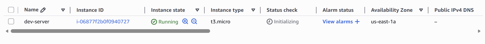
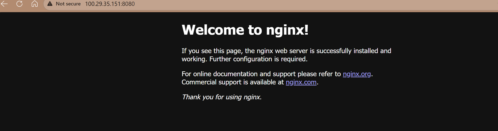

## Project Overview
This Terraform project provisions a simple AWS-based infrastructure for running a containerized web application. It creates:
- A **VPC** with a defined CIDR block
- A **public subnet** with Internet access (via Internet Gateway and route table)
- A **webserver EC2 instance** running Docker and serving Nginx on port 8080
- Security groups that restrict SSH access to a single IP while allowing HTTP traffic from anywhere

The purpose is to provide a lightweight, reproducible environment for deploying and testing containerized applications in AWS.

---

## Architecture Diagram (Conceptual ASCII-style)

```
                +----------------------+
                |      AWS VPC         |
                |   10.0.0.0/16        |
                +----------+-----------+
                           |
                +----------v-----------+
                |   Public Subnet      |
                |   10.0.10.0/24       |
                +----------+-----------+
                           |
          +----------------v----------------+
          |   EC2 Instance (t3.micro)       |
          |   Amazon Linux 2 AMI            |
          |   Docker + Nginx (port 8080)    |
          +----------------+----------------+
                           |
                +----------v-----------+
                | Security Group       |
                | - SSH: my_ip only    |
                | - HTTP: 0.0.0.0/0    |
                +----------------------+
```

---

## Module Documentation

### Subnet Module
**Inputs**
- `vpc_id`: VPC ID
- `subnet_cidr_block`: CIDR for subnet
- `avail_zone`: Availability zone
- `env_prefix`: Environment prefix

**Resources**
- `aws_subnet`
- `aws_internet_gateway`
- `aws_route_table`
- `aws_route_table_association`

**Outputs**
- `subnet`: Subnet resource

---

### Webserver Module
**Inputs**
- `vpc_id`: VPC ID
- `subnet_id`: Subnet ID
- `my_ip`: CIDR for SSH access
- `instance_type`: EC2 type
- `avail_zone`: Availability zone
- `image_name`: AMI filter
- `env_prefix`: Environment prefix

**Resources**
- `aws_security_group`
- `aws_instance`
- `data.aws_ami`

**Outputs**
- `security_group_id`
- `instance_id`
- `public_ip`

---

## Configuration Details
- **Provider:** AWS, region `us-east-1`
- **State:** Local state (no backend config provided, but can be extended to S3 + DynamoDB for production)
- **Variables:** Defined in `variables.tf`, values provided via `dev.tfvars`

---

## Deployment Instructions
1. **Initialize Terraform**
   ```bash
   terraform init
   ```
2. **Validate configuration**
   ```bash
   terraform validate
   ```
3. **Plan deployment**
   ```bash
   terraform plan -var-file=dev.tfvars
   ```
4. **Apply deployment**
   ```bash
   terraform apply -var-file=dev.tfvars
   ```
5. **Outputs**
   - Security Group ID
   - Instance ID
   - Public IP (use to access Nginx on port 8080)

---
## Screenshots

### EC2 Instance Running
Shows the EC2 instance named `dev-server` in the AWS Console, confirming it's in the `running` state with type `t3.micro`.



---

### VPC Overview
Displays the `dev-vpc` with CIDR block `10.0.0.0/16`, confirming it's available and properly configured.


---

### Internet Gateway Attached
Shows the `dev-igw` Internet Gateway successfully attached to the VPC, enabling outbound traffic.


---

### Subnet Configuration
Displays the `dev-subnet-1` with CIDR `10.0.10.0/24`, confirming it's available and linked to the correct VPC.


---

### Route Table Association
Shows the `dev-route-table` associated with the subnet, routing traffic to the Internet Gateway.


---

### Nginx Welcome Page
Confirms the webserver is running and accessible via public IP on port 8080.



---

## Operations Guide
- **Monitoring:** Use AWS CloudWatch for EC2 metrics (CPU, memory, network). Enable logging for Docker/Nginx.
- **Scaling:** Current setup is single-instance. For scaling, integrate Auto Scaling Groups and Load Balancers.
- **Backup:** AMI snapshots for EC2, S3 for persistent data. Current setup is stateless (Nginx container).
- **Cost:** Minimal (t3.micro + networking). Monitor with AWS Cost Explorer. Scale down unused resources to save cost.
- **Security:** Rotate SSH keys, restrict SG rules, consider private subnets for production workloads.

---

Imagine you’re building a **small house** 🏠:

- The **VPC** is like the plot of land where your house sits.
- The **subnet** is the fenced area inside the plot where you actually build.
- The **Internet Gateway + route table** are like the driveway and road connection that let cars (Internet traffic) reach your house.
- The **security group** is the lock on your front door — only you can come in through SSH, but anyone can visit through the main door (port 8080).
- The **EC2 instance** is the house itself — inside, you set up a kitchen (Docker) and start cooking meals (Nginx webserver).
- The **user data script** is your moving crew — they set everything up automatically when the house is built.

---

### What problem this solves
Instead of manually setting up servers and networks, Terraform builds everything for you in minutes. It’s like hiring a construction team that follows a blueprint exactly every time.

---

### Step-by-step walkthrough
1. Terraform lays down the land (VPC).
2. It builds a fenced area (subnet).
3. It connects the driveway (Internet Gateway + route table).
4. It sets up locks (security group).
5. It builds the house (EC2 instance).
6. The moving crew (user data script) installs Docker and runs Nginx automatically.
7. You get the house address (public IP) so visitors can come in on port 8080.

---

### Real-world benefits
- **Speed:** Infrastructure is ready in minutes.
- **Cost:** Uses a small EC2 instance (`t3.micro`), cheap for testing.
- **Reliability:** Blueprint (Terraform code) ensures consistent builds.
- **Flexibility:** Can scale up later with more instances or load balancers.
- **Security:** Only your IP can SSH in, reducing risk.

---
